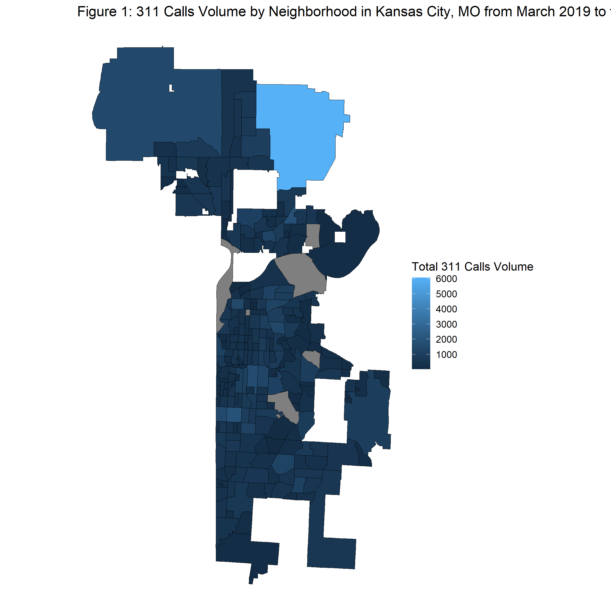
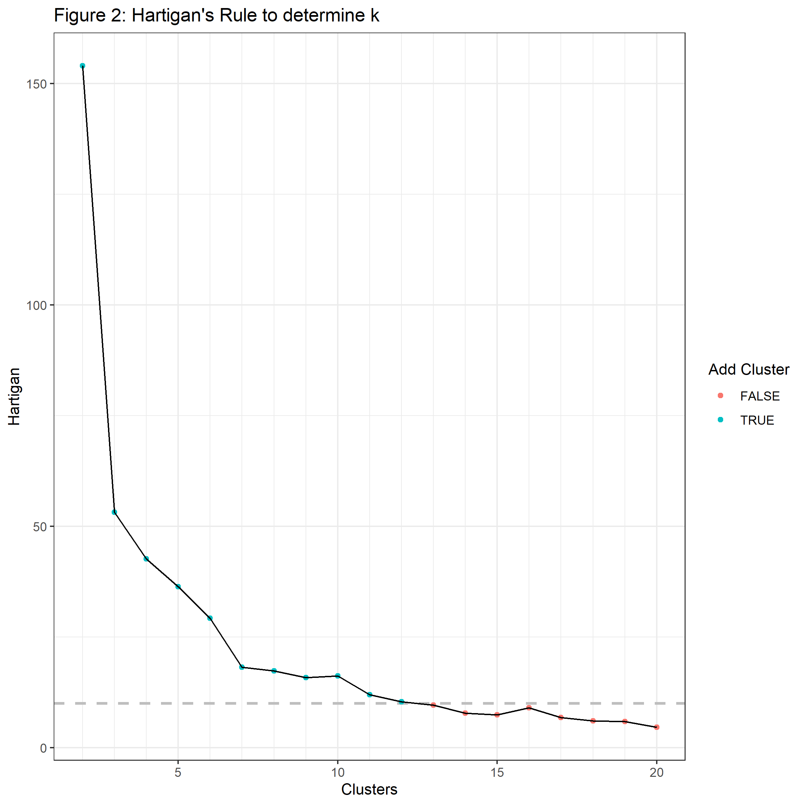
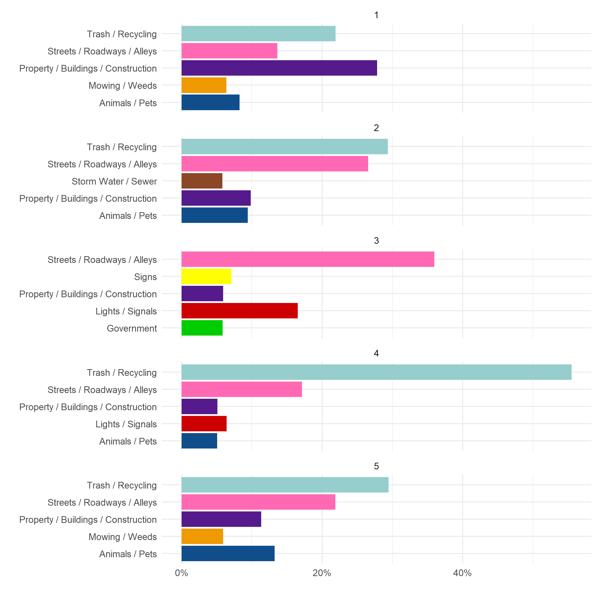
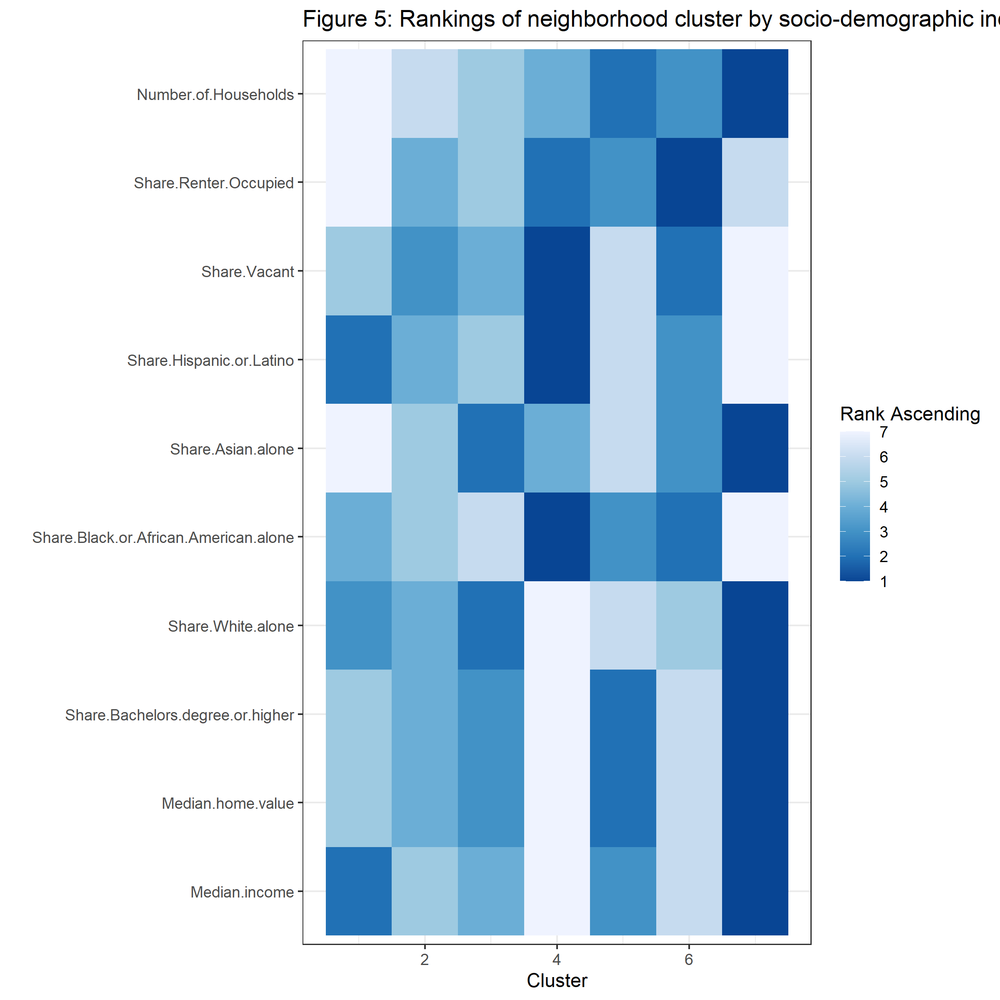

Characterizing Neighborhood Using 311 Calls: A Case Study of Kansas City
================

Thao Tran

October 2023

<!-- **Abstracts** -->
<!-- TBD  -->

### Intro

From Evicted - Mathew Desmond, we learned that in Milwaukee at the time
multiple nuisance activities 911 calls on a property can lead to police
service charges to property owners. This might lead to landlord eviction
renters. Nuisance activities are especially concentrated in low income,
deep poverty neighborhoods. These calls are reported under “Trouble with
Subjects”, noise complaints, and domestic violence.

Connecting this to the above literature of using 311 calls as indicators
of neighborhood distress and characteristics of urban neighborhoods. In
another way, 311 calls can be used as a real time indicator of
neighborhood characteristics in addition to much lagged
socio-demographic estimates.

### Data

#### About 311 data

<!-- -->

| CATEGORY                            | Neighborhood_Count | Min | Mean | Median |  SD |   Max |  Total |
|:------------------------------------|-------------------:|----:|-----:|-------:|----:|------:|-------:|
| Animals / Pets                      |                238 |   2 |   50 |     30 |  54 |   383 | 11,906 |
| Capital Projects                    |                201 |   1 |    6 |      4 |   7 |    48 |  1,223 |
| City Facilities                     |                 19 |   1 |    3 |      1 |   6 |    27 |     55 |
| Government                          |                174 |   1 |    5 |      3 |   9 |    86 |    841 |
| Lights / Signals                    |                238 |   1 |   22 |     16 |  32 |   388 |  5,218 |
| Mowing / Weeds                      |                229 |   1 |   26 |     17 |  29 |   158 |  5,979 |
| Parks & Recreation                  |                160 |   1 |    8 |      5 |   8 |    46 |  1,270 |
| Property / Buildings / Construction |                236 |   1 |   61 |     36 | 105 | 1,219 | 14,502 |
| Public Health                       |                225 |   1 |   12 |      9 |  12 |    58 |  2,804 |
| Public Safety                       |                121 |   1 |    3 |      2 |   4 |    21 |    398 |
| Sidewalks / Curbs / Ditch           |                213 |   1 |   10 |      7 |  12 |   102 |  2,083 |
| Signs                               |                233 |   1 |   13 |      9 |  16 |   180 |  3,042 |
| Storm Water / Sewer                 |                237 |   1 |   26 |     21 |  22 |   129 |  6,263 |
| Streets / Roadways / Alleys         |                240 |   5 |  112 |     80 | 122 | 1,036 | 26,798 |
| Trash / Recycling                   |                239 |   1 |  144 |     93 | 237 | 3,355 | 34,344 |

#### About demographic and socioeconomic data

| Socioeconomic_Demographic             | Neighborhood_Count |       Min |       Mean |     Median |         SD |          Max |
|:--------------------------------------|-------------------:|----------:|-----------:|-----------:|-----------:|-------------:|
| Median.home.value                     |                240 |  9,999.00 | 164,046.35 | 126,441.50 | 142,405.10 | 1,035,700.00 |
| Median.income                         |                240 | 14,615.00 |  58,876.66 |  51,874.50 |  33,941.44 |   250,001.00 |
| Number.of.Households                  |                240 |    191.00 |     495.03 |     448.00 |     207.61 |     1,496.00 |
| Share.Asian.alone                     |                240 |      0.00 |       1.60 |       0.81 |       2.09 |        12.86 |
| Share.Bachelors.degree.or.higher      |                240 |      0.61 |      18.26 |      15.40 |      12.99 |        54.72 |
| Share.Black.or.African.American.alone |                240 |      0.00 |      24.24 |      13.43 |      22.82 |        96.33 |
| Share.Hispanic.or.Latino              |                240 |      0.00 |       7.95 |       5.32 |       9.63 |        62.37 |
| Share.Renter.Occupied                 |                240 |      0.00 |      45.53 |      47.04 |      24.07 |       100.00 |
| Share.Vacant                          |                240 |      0.00 |      15.68 |      11.69 |      13.57 |        64.72 |
| Share.White.alone                     |                240 |      0.84 |      41.38 |      42.56 |      24.00 |        99.31 |

### Classification based on 311 service categories

| Clusters |  Hartigan | AddCluster |
|---------:|----------:|:-----------|
|        2 | 74.494711 | TRUE       |
|        3 | 66.612205 | TRUE       |
|        4 | 36.756455 | TRUE       |
|        5 | 25.163992 | TRUE       |
|        6 | 25.544523 | TRUE       |
|        7 | 26.048695 | TRUE       |
|        8 | 18.600090 | TRUE       |
|        9 | 20.717732 | TRUE       |
|       10 | 18.607223 | TRUE       |
|       11 | 12.582173 | TRUE       |
|       12 | 11.772134 | TRUE       |
|       13 | 11.531513 | TRUE       |
|       14 | 10.798111 | TRUE       |
|       15 |  8.273269 | FALSE      |
|       16 |  7.981346 | FALSE      |
|       17 |  8.828804 | FALSE      |
|       18 |  7.508005 | FALSE      |
|       19 |  9.446460 | FALSE      |
|       20 |  7.645774 | FALSE      |

<!-- -->

| Neighborhood                               | Cluster | Neighborhood_Count |
|:-------------------------------------------|--------:|-------------------:|
| River Market                               |       1 |                 25 |
| Quality Hill                               |       1 |                 25 |
| Hospital Hill                              |       1 |                 25 |
| Crossroads                                 |       1 |                 25 |
| Westside North                             |       1 |                 25 |
| Westside South                             |       1 |                 25 |
| Crown Center                               |       1 |                 25 |
| Pendleton Heights                          |       1 |                 25 |
| Independence Plaza                         |       1 |                 25 |
| Sheffield                                  |       1 |                 25 |
| North Blue Ridge                           |       1 |                 25 |
| Wendell Phillips                           |       1 |                 25 |
| South Blue Valley                          |       1 |                 25 |
| Ivanhoe Southeast                          |       1 |                 25 |
| Key Coalition                              |       1 |                 25 |
| South Hyde Park                            |       1 |                 25 |
| Southmoreland                              |       1 |                 25 |
| Mission Lake                               |       1 |                 25 |
| Antioch Acres                              |       1 |                 25 |
| Chaumiere                                  |       1 |                 25 |
| Winnwood                                   |       1 |                 25 |
| Glenhaven                                  |       1 |                 25 |
| Ravenwood-Somerset                         |       1 |                 25 |
| Maple Park West                            |       1 |                 25 |
| Maple Park                                 |       1 |                 25 |
| Columbus Park Industrial                   |       2 |                176 |
| Paseo West                                 |       2 |                176 |
| Union Hill                                 |       2 |                176 |
| Longfellow                                 |       2 |                176 |
| Northeast Industrial District              |       2 |                176 |
| Columbus Park                              |       2 |                176 |
| Parkview                                   |       2 |                176 |
| Forgotten Homes                            |       2 |                176 |
| Beacon Hills                               |       2 |                176 |
| 18th And Vine And Downtown East            |       2 |                176 |
| Central Blue Valley And Park Tower Gardens |       2 |                176 |
| West Blue Valley                           |       2 |                176 |
| East Blue Valley                           |       2 |                176 |
| Blue Valley Industrial                     |       2 |                176 |
| Western Blue Township                      |       2 |                176 |
| Cunningham Ridge                           |       2 |                176 |
| Ashland Ridge                              |       2 |                176 |
| Riss Lake                                  |       2 |                176 |
| Sterling Acres                             |       2 |                176 |
| Sterling Gardens                           |       2 |                176 |
| Stayton Meadows                            |       2 |                176 |
| Coachlight Square                          |       2 |                176 |
| Lewis Heights                              |       2 |                176 |
| Leeds                                      |       2 |                176 |
| Eastwood Hills West                        |       2 |                176 |
| Vineyard Northwest                         |       2 |                176 |
| Vineyard Estates                           |       2 |                176 |
| Mount Hope                                 |       2 |                176 |
| Linwood Homeowners-Ivanhoe                 |       2 |                176 |
| Ivanhoe Southwest                          |       2 |                176 |
| Ivanhoe Northeast                          |       2 |                176 |
| Palestine West And Oak Park Northeast      |       2 |                176 |
| Palestine East                             |       2 |                176 |
| Ingleside                                  |       2 |                176 |
| Boulevard Village                          |       2 |                176 |
| Dunbar                                     |       2 |                176 |
| Center City                                |       2 |                176 |
| Squier Park                                |       2 |                176 |
| Manheim Park                               |       2 |                176 |
| Coleman Highlands                          |       2 |                176 |
| Roanoke                                    |       2 |                176 |
| Valentine                                  |       2 |                176 |
| Hanover Place                              |       2 |                176 |
| Broadway Gillham                           |       2 |                176 |
| North Hyde Park                            |       2 |                176 |
| Central Hyde Park                          |       2 |                176 |
| Rockhill                                   |       2 |                176 |
| Old Westport                               |       2 |                176 |
| Plaza Westport                             |       2 |                176 |
| Westwood                                   |       2 |                176 |
| Country Club Plaza                         |       2 |                176 |
| Park Central-Research Park                 |       2 |                176 |
| Sunset Hill West                           |       2 |                176 |
| Sunset Hill                                |       2 |                176 |
| Ward Estates                               |       2 |                176 |
| Countryside                                |       2 |                176 |
| South Plaza                                |       2 |                176 |
| Crestwood                                  |       2 |                176 |
| Brookside Park                             |       2 |                176 |
| Morningside                                |       2 |                176 |
| Wornall Homestead                          |       2 |                176 |
| Country Club                               |       2 |                176 |
| Greenway Fields                            |       2 |                176 |
| Country Club District                      |       2 |                176 |
| Stratford Gardens                          |       2 |                176 |
| Romanelli West                             |       2 |                176 |
| Armour Fields                              |       2 |                176 |
| Armour Hills                               |       2 |                176 |
| Oak Meyer Gardens                          |       2 |                176 |
| Holmes Park                                |       2 |                176 |
| Ward Parkway Plaza                         |       2 |                176 |
| West Waldo                                 |       2 |                176 |
| Rolling Meadows                            |       2 |                176 |
| Rockhill Manor                             |       2 |                176 |
| Mount Cleveland                            |       2 |                176 |
| Sheraton Estates                           |       2 |                176 |
| South Town Fork Creek                      |       2 |                176 |
| Citadel                                    |       2 |                176 |
| Neighbors United For Action                |       2 |                176 |
| Blenheim Square Research Hospital          |       2 |                176 |
| Swope Park Campus                          |       2 |                176 |
| Self Help Neighborhood Council             |       2 |                176 |
| Foxtown East                               |       2 |                176 |
| Marlborough East                           |       2 |                176 |
| Brown Estates                              |       2 |                176 |
| Swope Park Ridge-Winchester                |       2 |                176 |
| Strupwood                                  |       2 |                176 |
| East Swope Highlands                       |       2 |                176 |
| Oldham Farms                               |       2 |                176 |
| Hillcrest                                  |       2 |                176 |
| Santa Fe Hills                             |       2 |                176 |
| Boone Hills                                |       2 |                176 |
| Legacy East                                |       2 |                176 |
| Linden Hills And Indian Heights            |       2 |                176 |
| Willow Creek                               |       2 |                176 |
| Lea Manor                                  |       2 |                176 |
| Country Lane Estates                       |       2 |                176 |
| Bridlespur                                 |       2 |                176 |
| Red Bridge North                           |       2 |                176 |
| Red Bridge South                           |       2 |                176 |
| Foxcroft And Glen Arbor                    |       2 |                176 |
| Verona Hills                               |       2 |                176 |
| Blue Hills Estates                         |       2 |                176 |
| Woodbridge                                 |       2 |                176 |
| Hidden Valley                              |       2 |                176 |
| Sechrest                                   |       2 |                176 |
| Oakwood                                    |       2 |                176 |
| St Catherines Gardens                      |       2 |                176 |
| Royal Oaks                                 |       2 |                176 |
| Terrace Lake Gardens                       |       2 |                176 |
| Calico Farms                               |       2 |                176 |
| Loma Vista                                 |       2 |                176 |
| Stratford Estates                          |       2 |                176 |
| Hickman Mills                              |       2 |                176 |
| White Oak                                  |       2 |                176 |
| Robandee South                             |       2 |                176 |
| Bannister Acres                            |       2 |                176 |
| Hickman Mills South                        |       2 |                176 |
| Ruskin Hills                               |       2 |                176 |
| Crossgates                                 |       2 |                176 |
| Kirkside                                   |       2 |                176 |
| Longview                                   |       2 |                176 |
| Highview Estates                           |       2 |                176 |
| Unity Ridge                                |       2 |                176 |
| Country Valley-Hawthorn Square             |       2 |                176 |
| Blue Vue Hills                             |       2 |                176 |
| Glen Lake                                  |       2 |                176 |
| Fairway Hills                              |       2 |                176 |
| Woodson Estates                            |       2 |                176 |
| Timber Valley                              |       2 |                176 |
| Martin City                                |       2 |                176 |
| Blue Ridge Farms                           |       2 |                176 |
| Richards Gebaur                            |       2 |                176 |
| Harlem                                     |       2 |                176 |
| Briarcliff West                            |       2 |                176 |
| Briarcliff And Claymont                    |       2 |                176 |
| River View                                 |       2 |                176 |
| Crestview                                  |       2 |                176 |
| Colonial Square                            |       2 |                176 |
| River Forest                               |       2 |                176 |
| Cooley Highlands S                         |       2 |                176 |
| Chouteau Estates                           |       2 |                176 |
| Holiday Hills                              |       2 |                176 |
| Sherwood Estates                           |       2 |                176 |
| Country Club Estates And Big Shoal         |       2 |                176 |
| Foxwoods-Carriage Hills                    |       2 |                176 |
| Winnwood Gardens                           |       2 |                176 |
| Hill Haven                                 |       2 |                176 |
| Winnetonka                                 |       2 |                176 |
| Gracemor-Randolph Corners                  |       2 |                176 |
| Minneville                                 |       2 |                176 |
| Birmingham Bottoms                         |       2 |                176 |
| Clayton                                    |       2 |                176 |
| Lakeview Terrace                           |       2 |                176 |
| Tanglewood And Regency North               |       2 |                176 |
| Prairie Point-Wildberry                    |       2 |                176 |
| Barry Harbour                              |       2 |                176 |
| Platte Brook North                         |       2 |                176 |
| The Coves                                  |       2 |                176 |
| Platte Ridge                               |       2 |                176 |
| Park Forest                                |       2 |                176 |
| Royal Oaks North                           |       2 |                176 |
| Linden Park                                |       2 |                176 |
| Hawthorne And Picture Hills                |       2 |                176 |
| Parkdale And Walden                        |       2 |                176 |
| Breen Hills                                |       2 |                176 |
| Park Plaza                                 |       2 |                176 |
| Line Creek And Northern Heights            |       2 |                176 |
| Outer Gashland-Nashua                      |       2 |                176 |
| Nashua                                     |       2 |                176 |
| Meadowbrook Heights                        |       2 |                176 |
| New Mark                                   |       2 |                176 |
| Gashland                                   |       2 |                176 |
| Sherrydale                                 |       2 |                176 |
| Jefferson Highlands                        |       2 |                176 |
| Ridgefield                                 |       2 |                176 |
| CBD Downtown                               |       3 |                  1 |
| Shoal Creek                                |       4 |                  1 |
| Lykins                                     |       5 |                 37 |
| Scarritt Point                             |       5 |                 37 |
| North Indian Mound                         |       5 |                 37 |
| South Indian Mound                         |       5 |                 37 |
| Washington Wheatley                        |       5 |                 37 |
| East Community Team North                  |       5 |                 37 |
| East Community Team South                  |       5 |                 37 |
| Eastwood Hills East                        |       5 |                 37 |
| Vineyard                                   |       5 |                 37 |
| Santa Fe                                   |       5 |                 37 |
| Oak Park Northwest                         |       5 |                 37 |
| Oak Park Southwest                         |       5 |                 37 |
| Oak Park Southeast                         |       5 |                 37 |
| Knoches Park                               |       5 |                 37 |
| Volker                                     |       5 |                 37 |
| West Plaza                                 |       5 |                 37 |
| Western 49-63                              |       5 |                 37 |
| Tower Homes                                |       5 |                 37 |
| Ward Parkway                               |       5 |                 37 |
| Waldo Homes                                |       5 |                 37 |
| Eastern 49-63                              |       5 |                 37 |
| Swope Parkway-Elmwood                      |       5 |                 37 |
| North Town Fork Creek                      |       5 |                 37 |
| Blue Hills                                 |       5 |                 37 |
| Noble And Gregory Ridge                    |       5 |                 37 |
| East Meyer 7                               |       5 |                 37 |
| East Meyer 6                               |       5 |                 37 |
| Marlborough Heights/Marlborough Pride      |       5 |                 37 |
| Park Farms                                 |       5 |                 37 |
| Western Hills                              |       5 |                 37 |
| Fairlane                                   |       5 |                 37 |
| Fairwood And Robandee                      |       5 |                 37 |
| Ruskin Heights                             |       5 |                 37 |
| Little Blue                                |       5 |                 37 |
| Davidson                                   |       5 |                 37 |
| Coves North                                |       5 |                 37 |
| KCI & 2nd Creek                            |       5 |                 37 |

<!-- -->

<!-- -->

### Socioeconomic features among clusters

<!-- -->
