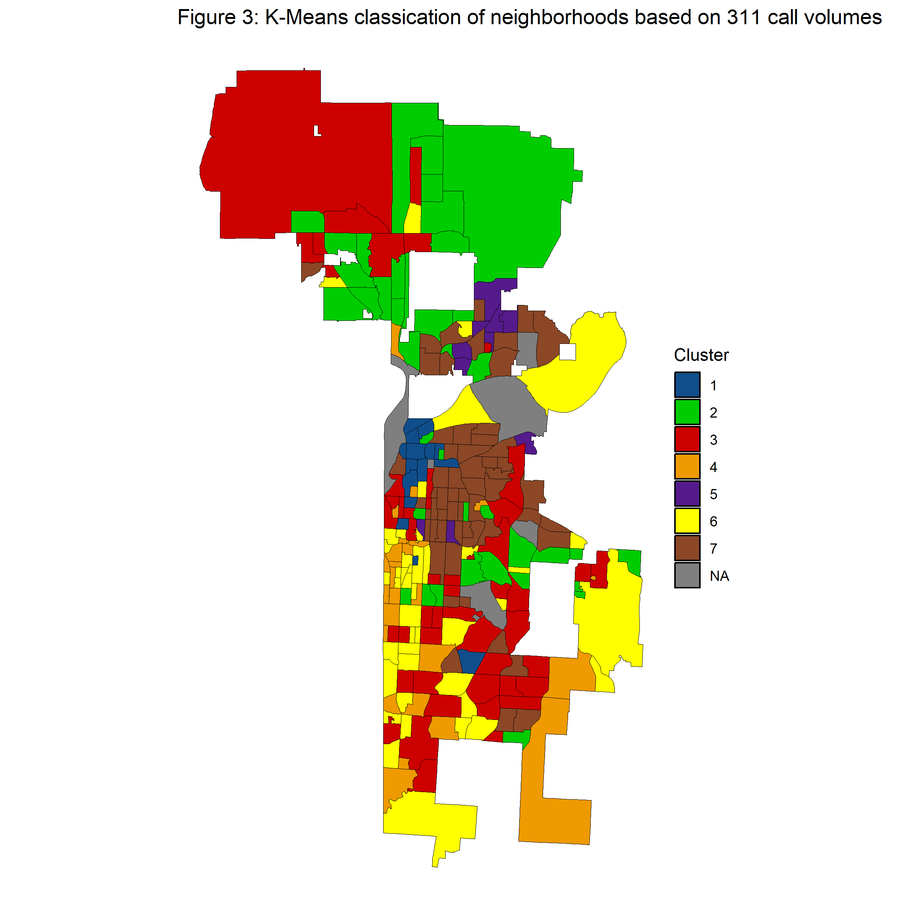
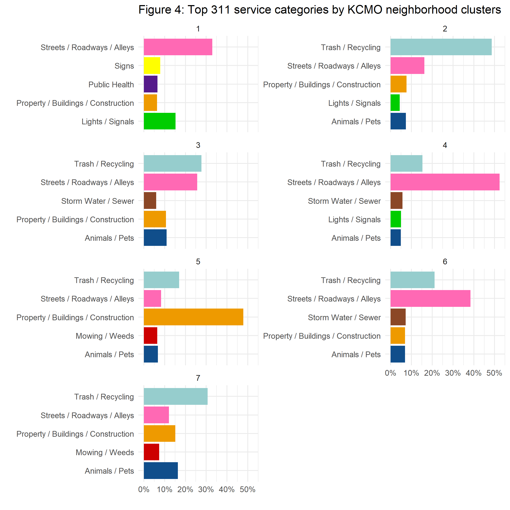

Characterizing Neighborhood Using 311 Calls: A Case Study of Kansas City
================

Thao Tran

October 2023

<!-- **Abstracts** -->
<!-- TBD  -->

### Introduction

Urban environments are characterized by a complex tapestry of diverse
neighborhoods, each exhibiting unique socio-economic, cultural, and
infrastructural features. Effective urban planning and decision-making
demand an intricate understanding of these localized contexts.
Traditional demographic estimates, though invaluable, often suffer from
temporal lags that limit their real-time applicability. In response to
this challenge, emerging research suggests that 311 non-emergency
service calls offer an innovative avenue for constructing a dynamic and
cost-effective indicators of urban neighborhoods. These service
requests, encompassing a wide array of concerns raised by residents,
possess the potential to serve as invaluable indicators of neighborhood
distress and characteristics. By scrutinizing this wealth of data, urban
stakeholders can gain unprecedented insights into local conditions,
aiding in the formulation of targeted interventions and policies.

The utilization of 311 Service Requests as a tool for characterizing
urban neighborhoods represents a burgeoning area of inquiry in urban
studies and planning. Notably, seminal work by [Wang et al
(2017)](https://www.ncbi.nlm.nih.gov/pmc/articles/PMC5645100/)
highlights the capacity of 311 data to unveil the intricate fabric of
urban systems. Through detailed analysis of New York City, Boston, and
Chicago, the study demonstrates how these requests, categorized by type
and location, furnish a robust foundation for delineating distinct
socio-economic profiles across neighborhoods. This innovative
classification, hinged on 311 data, presents an invaluable resource for
modeling various socio-economic features, offering a real-time
counterpart to conventional, lagged estimates.

Furthermore, the implications of this research extend beyond theoretical
classifications. The findings underscore the practical utility of
311-based characterizations in forecasting future trends, particularly
in the realm of local real estate prices. This revelation suggests that
311 Service Requests harbor the potential not only to monitor but also
to predict the socio-economic performance of urban neighborhoods. Such
predictive capabilities empower urban stakeholders with the means to
quantitatively evaluate the impacts of their interventions, fostering a
more dynamic and responsive approach to urban planning.

In light of these compelling insights, this paper builds upon this
foundational work, delving deeper into the potential of 311 data as a
dynamic lens through which to understand and address the challenges of
urban environments. Through rigorous analysis and modeling, we seek to
augment the understanding of how 311 Service Requests in Kansas City
Missouri (KCMO) can serve as an invaluable real-time indicator of
neighborhood characteristics, complementing conventional demographic
estimates and enabling more informed, timely, and effective urban
interventions.

### Data

#### About 311 data

The data utilized in this study originates from the Kansas City Open
Data website, spanning from March 1st, 2019 to February 1st, 2020. This
temporal scope allows for an examination of non-emergency service
requests across four counties within the Kansas City, Missouri area,
namely Jackson, Clay, Platte, and Cass. This pre-pandemic timeframe
offers a valuable baseline for understanding the dynamics of urban
service requests prior to the influence of extraordinary events such as
the COVID-19 pandemic. The 311 system serves as a conduit through which
local government entities provide non-emergency assistance to residents,
visitors, and businesses. It addresses reported disruptions in services,
unsafe situations, and disturbances affecting quality of life. Although
requests are received through various channels such as text messages,
web forms, and dedicated mobile applications, the majority are received
via phone calls. These 311 service requests and complaints encompass a
wide spectrum of concerns, including, but not limited to, noise
disturbances, building heating outages, and sightings of rodents.
Consequently, this data proves to be an invaluable resource for
comprehending the provision of crucial municipal services and gauging
neighborhood conditions.

<!-- -->

The number of total requests during the time frame for the 311 data in
KCMO is at 117 thousands, about a fifth of the city’s population during
the same year. Kansas City’s 311 data are categorized in 15 types which
are listed below.

| CATEGORY                            | Neighborhood_Count | Min | Mean | Median |  SD |   Max |  Total |
|:------------------------------------|-------------------:|----:|-----:|-------:|----:|------:|-------:|
| Animals / Pets                      |                238 |   2 |   50 |     30 |  54 |   383 | 11,906 |
| Capital Projects                    |                201 |   1 |    6 |      4 |   7 |    48 |  1,223 |
| City Facilities                     |                 19 |   1 |    3 |      1 |   6 |    27 |     55 |
| Government                          |                174 |   1 |    5 |      3 |   9 |    86 |    841 |
| Lights / Signals                    |                238 |   1 |   22 |     16 |  32 |   388 |  5,218 |
| Mowing / Weeds                      |                229 |   1 |   26 |     17 |  29 |   158 |  5,979 |
| Parks & Recreation                  |                160 |   1 |    8 |      5 |   8 |    46 |  1,270 |
| Property / Buildings / Construction |                236 |   1 |   61 |     36 | 105 | 1,219 | 14,502 |
| Public Health                       |                225 |   1 |   12 |      9 |  12 |    58 |  2,804 |
| Public Safety                       |                121 |   1 |    3 |      2 |   4 |    21 |    398 |
| Sidewalks / Curbs / Ditch           |                213 |   1 |   10 |      7 |  12 |   102 |  2,083 |
| Signs                               |                233 |   1 |   13 |      9 |  16 |   180 |  3,042 |
| Storm Water / Sewer                 |                237 |   1 |   26 |     21 |  22 |   129 |  6,263 |
| Streets / Roadways / Alleys         |                240 |   5 |  112 |     80 | 122 | 1,036 | 26,798 |
| Trash / Recycling                   |                239 |   1 |  144 |     93 | 237 | 3,355 | 34,344 |

Table 1: Summary statitics of 311 Calls by 311 Non-Emergency Service
Categories

The 311 data contains one record for each call including information
such as: type of request, time of request, open/close status of request,
and location of request. We aggregate 311 calls and group by type and
neighborhood.

#### About demographic and socioeconomic data

As we attempt to use 311 data to characterize urban neighborhood in
complement to existing socio-demographic indicators. For socioeconomic
and demographic features, we use data data from U.S. Census 2019
American Community Survey (ACS).

| Socioeconomic_Demographic             | Neighborhood_Count |       Min |       Mean |     Median |         SD |          Max |
|:--------------------------------------|-------------------:|----------:|-----------:|-----------:|-----------:|-------------:|
| Median.home.value                     |                240 |  9,999.00 | 164,046.35 | 126,441.50 | 142,405.10 | 1,035,700.00 |
| Median.income                         |                240 | 14,615.00 |  58,876.66 |  51,874.50 |  33,941.44 |   250,001.00 |
| Number.of.Households                  |                240 |    191.00 |     495.03 |     448.00 |     207.61 |     1,496.00 |
| Share.Asian.alone                     |                240 |      0.00 |       1.60 |       0.81 |       2.09 |        12.86 |
| Share.Bachelors.degree.or.higher      |                240 |      0.61 |      18.26 |      15.40 |      12.99 |        54.72 |
| Share.Black.or.African.American.alone |                240 |      0.00 |      24.24 |      13.43 |      22.82 |        96.33 |
| Share.Hispanic.or.Latino              |                240 |      0.00 |       7.95 |       5.32 |       9.63 |        62.37 |
| Share.Renter.Occupied                 |                240 |      0.00 |      45.53 |      47.04 |      24.07 |       100.00 |
| Share.Vacant                          |                240 |      0.00 |      15.68 |      11.69 |      13.57 |        64.72 |
| Share.White.alone                     |                240 |      0.84 |      41.38 |      42.56 |      24.00 |        99.31 |

Table 2: Summary statistics of socio-demographic characteristics across
neighborhoods in Kansas City, MO

### Classification based on 311 service categories

We define a 311 service composition for a neighborhood using the
relative frequencies of 311 calls across different request types. These
compositions allow us to gain initial insight to the usage and needs of
311 services across different communities. This approach characterizes
the unique residents’ needs for 311 service in a given neighborhood,
highlighting particular concerns that are most important to the local
community.

For a neighborhood $i$, its composition is represented with
$C(i) = (\frac{N_{i,t}}{N_i}, t=1...T)$, where $N_{i,t}$ is the total
number of request in category $t$ in neighborhood $i$, $N_i$ is the
total number of 311 request in neighborhood $i$ which can be also be
written as $N_i = \sum_t N_{i,t}$, and $T$ is total number of service
categories.

The 311 services composition $C_i$ describes unique characteristics of
neighborhood $i$ and there are likely groups of neighborhoods that share
similar composition like how areas share similar socioeconomic
characteristics. We apply k-mean clustering to multi-dimensional
composition $C_i$ to classify neighborhoods with similar 311 service
characteristics into distinct clusters. We get an optimal clustering we
run the algorithm 100 times using cumulative square sum of distances
from centroids.

The key step in k-mean clustering is to identify an appropriate number
of clusters. We evaluate the clustering model with Hartigan–Wong method
as shown below. Given the socioeconomic diversity across neighborhoods
in the selected cities, we determine that a minimum of three clusters is
an appropriate value.

| Clusters |   Hartigan | AddCluster |
|---------:|-----------:|:-----------|
|        2 | 154.038765 | TRUE       |
|        3 |  53.208288 | TRUE       |
|        4 |  42.684546 | TRUE       |
|        5 |  36.385655 | TRUE       |
|        6 |  29.294647 | TRUE       |
|        7 |  18.186312 | TRUE       |
|        8 |  17.410499 | TRUE       |
|        9 |  15.870979 | TRUE       |
|       10 |  16.239130 | TRUE       |
|       11 |  11.989314 | TRUE       |
|       12 |  10.394229 | TRUE       |
|       13 |   9.620304 | FALSE      |
|       14 |   7.813568 | FALSE      |
|       15 |   7.436994 | FALSE      |
|       16 |   9.065580 | FALSE      |
|       17 |   6.836910 | FALSE      |
|       18 |   6.072479 | FALSE      |
|       19 |   5.951516 | FALSE      |
|       20 |   4.648143 | FALSE      |

<!-- -->

In the following figure, we show how the neighborhood are divided into
seven clusters base on the 311 service composition.

    ## - Cluster 1 includes: Columbus Park Industrial , River Market , Quality Hill , CBD Downtown , Paseo West , Hospital Hill , Crossroads , Crown Center , Parkview , 18th And Vine And Downtown East , Broadway Gillham , Old Westport , Crestwood , Sechrest , Harlem , 
    ## 
    ## - Cluster 2 includes: Columbus Park , Forgotten Homes , Sterling Gardens , Stayton Meadows , Eastwood Hills East , Lewis Heights , Palestine East , Dunbar , Central Hyde Park , Armour Hills , Swope Parkway-Elmwood , Neighbors United For Action , Blenheim Square Research Hospital , Brown Estates , Kirkside , Country Valley-Hawthorn Square , Woodson Estates , Timber Valley , Briarcliff And Claymont , Davidson , Colonial Square , Chouteau Estates , Country Club Estates And Big Shoal , Clayton , Lakeview Terrace , Tanglewood And Regency North , Prairie Point-Wildberry , Platte Brook North , The Coves , Parkdale And Walden , Breen Hills , Park Plaza , Line Creek And Northern Heights , Outer Gashland-Nashua , Nashua , New Mark , Gashland , Ridgefield , Shoal Creek , 
    ## 
    ## - Cluster 3 includes: Westside South , Beacon Hills , Blue Valley Industrial , Leeds , Eastwood Hills West , Center City , Volker , Coleman Highlands , Valentine , Hanover Place , Southmoreland , West Waldo , Waldo Homes , Sheraton Estates , South Town Fork Creek , Citadel , Swope Park Campus , Noble And Gregory Ridge , East Meyer 7 , East Meyer 6 , Marlborough Heights/Marlborough Pride , Swope Park Ridge-Winchester , East Swope Highlands , Park Farms , Hillcrest , Linden Hills And Indian Heights , Willow Creek , Verona Hills , Mission Lake , St Catherines Gardens , Loma Vista , Fairlane , Stratford Estates , White Oak , Robandee South , Bannister Acres , Hickman Mills South , Crossgates , Blue Vue Hills , Fairway Hills , Blue Ridge Farms , Holiday Hills , Coves North , Barry Harbour , Platte Ridge , Park Forest , Linden Park , KCI & 2nd Creek , Meadowbrook Heights , Jefferson Highlands , 
    ## 
    ## - Cluster 4 includes: Union Hill , Boulevard Village , Roanoke , Country Club Plaza , Park Central-Research Park , Sunset Hill West , Sunset Hill , Ward Estates , South Plaza , Country Club District , Romanelli West , Armour Fields , Holmes Park , Ward Parkway , Ward Parkway Plaza , Legacy East , Country Lane Estates , Red Bridge North , Woodbridge , Calico Farms , Longview , Highview Estates , Glen Lake , Martin City , Briarcliff West , 
    ## 
    ## - Cluster 5 includes: North Blue Ridge , Oak Park Southwest , South Hyde Park , Chaumiere , Cooley Highlands S , Glenhaven , Ravenwood-Somerset , Maple Park West , Winnwood Gardens , Maple Park , 
    ## 
    ## - Cluster 6 includes: Longfellow , Northeast Industrial District , Sterling Acres , Coachlight Square , Rockhill , Plaza Westport , West Plaza , Westwood , Countryside , Western 49-63 , Brookside Park , Morningside , Wornall Homestead , Country Club , Greenway Fields , Stratford Gardens , Oak Meyer Gardens , Tower Homes , Rolling Meadows , Rockhill Manor , Eastern 49-63 , Mount Cleveland , Marlborough East , Strupwood , Western Hills , Santa Fe Hills , Boone Hills , Lea Manor , Bridlespur , Red Bridge South , Foxcroft And Glen Arbor , Blue Hills Estates , Oakwood , Royal Oaks , Terrace Lake Gardens , Hickman Mills , Unity Ridge , Little Blue , Richards Gebaur , Sherwood Estates , Birmingham Bottoms , Hawthorne And Picture Hills , Sherrydale , 
    ## 
    ## - Cluster 7 includes: Westside North , Pendleton Heights , Independence Plaza , Lykins , Scarritt Point , North Indian Mound , South Indian Mound , Sheffield , Wendell Phillips , Washington Wheatley , East Community Team North , East Community Team South , South Blue Valley , Central Blue Valley And Park Tower Gardens , West Blue Valley , East Blue Valley , Western Blue Township , Cunningham Ridge , Ashland Ridge , Riss Lake , Vineyard Northwest , Vineyard , Vineyard Estates , Mount Hope , Linwood Homeowners-Ivanhoe , Ivanhoe Southwest , Ivanhoe Southeast , Ivanhoe Northeast , Key Coalition , Santa Fe , Oak Park Northwest , Oak Park Southeast , Palestine West And Oak Park Northeast , Ingleside , Knoches Park , Squier Park , Manheim Park , North Hyde Park , North Town Fork Creek , Blue Hills , Self Help Neighborhood Council , Foxtown East , Oldham Farms , Hidden Valley , Fairwood And Robandee , Ruskin Hills , Ruskin Heights , River View , Crestview , Antioch Acres , River Forest , Winnwood , Foxwoods-Carriage Hills , Hill Haven , Winnetonka , Gracemor-Randolph Corners , Minneville , Royal Oaks North ,

<!-- -->

To gauge the difference in 311 service request characteristics among
clusters, we illustrate the distribution of top service requests
categories across the seven clusters. This reveals a distinct variation
in the composition.

<!-- -->

### Socioeconomic features among clusters

Given our understanding of the specific spatial contexts within the
analyzed cities, the emerging clusters align with intuitive
expectations. However, to quantitatively address how the local 311
service request patterns resembles the socioeconomic attributes of those
areas, we now compile and scrutinize the socioeconomic characteristics
associated with each of the identified clusters.

It’s important to note that, up to this point, the clustering outcomes
have been derived solely from the frequency of 311 service requests,
without incorporating any socioeconomic data. In the following step, we
aggregate information regarding socioeconomic indicators such as income
levels, educational attainment, as well as racial composition. We then
compare the ranking (ascending) of average levels of each indicator
within each of the designated clusters.

<!-- -->
